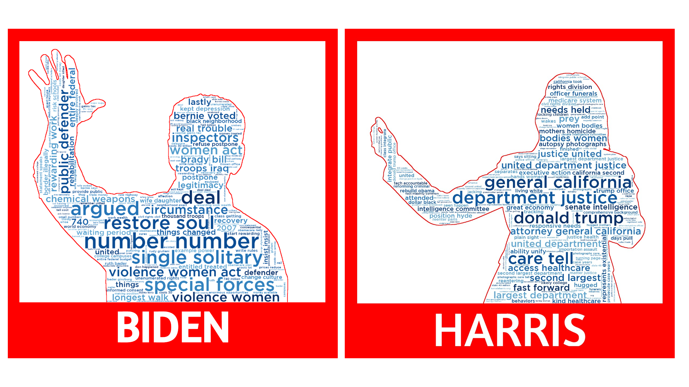
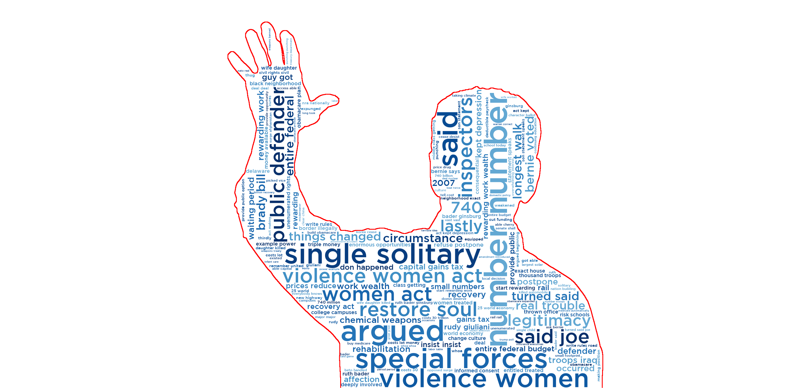

# Generating Word Clouds with WordCloud

This notebook walks through creating and customizing word clouds.
- Use an image mask to create any shape of word cloud
- Color word cloud text with colormaps and custom colors 
-  Use image-colors to color the word cloud
- Change the size, font, and number of text inside the word cloud

Find the accompanying Medium article found here. (https://bdickinson.medium.com)

